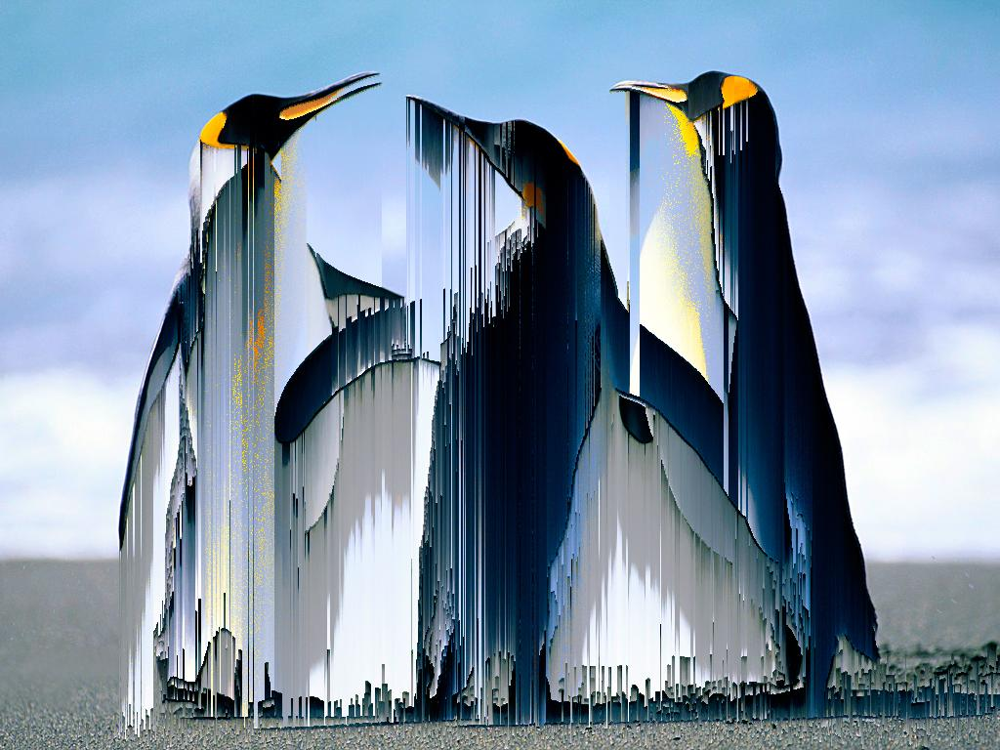
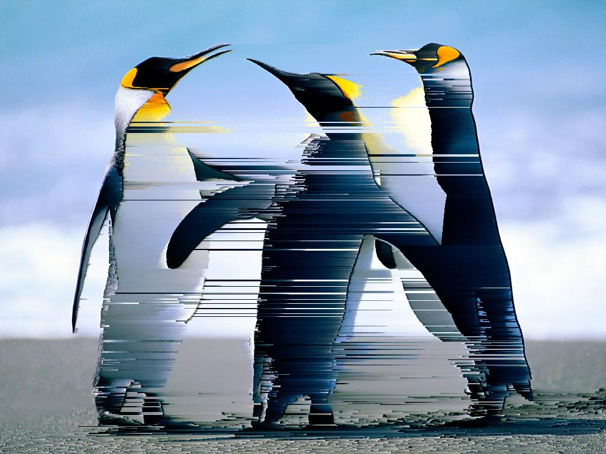
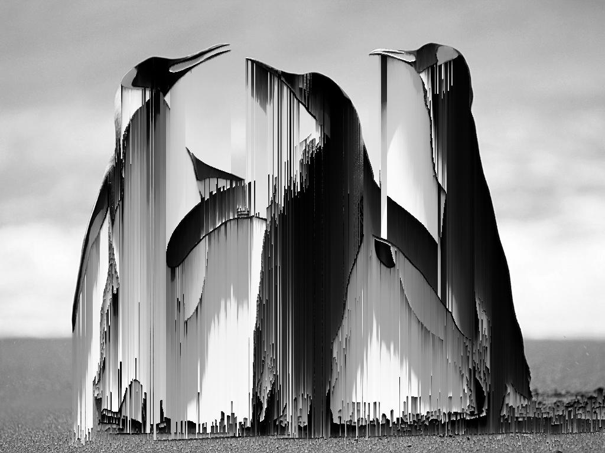
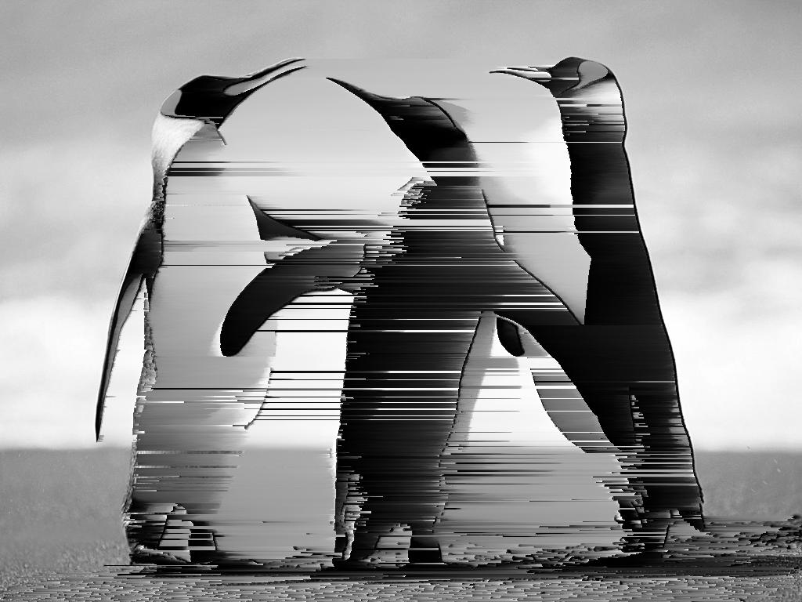

# pixel_sort

Python function for image pixel sorting.  
Sutable for glitch-art creation.

## Function defeniton

```
pixel_sort(PATH, sigma = 1, axis = 1, tresh= 0.05, Reverse = False, Grayscale = False, verbose = True)
```

### Inputs

+ PATH (Str) - path to original image
+ sigma - gaussian filter sigma for difference of gaussians edge detection
+ tresh - difference of gaussian edge detection trashold
+ Reverse - if True Reverse the sorting order
+ Grayscale - if True Grayscale the image
+ verbose - if True show resulting image on screen

### Outputs

+ PIL Image - containing the resulting image

## Gallery

```
img = pixel_sort("Data/Penguins.jpg", Reverse = False, Grayscale = False, sigma = 1, axis = 1, tresh= 0.05)# Full color pixel sort on axis 1
img = pixel_sort("Data/Penguins.jpg", Reverse = False, Grayscale = False, sigma = 1, axis = 0, tresh= 0.05)# Full color pixel sort on axis 0
```


| Original image                       | Full color pixel sort on axis 1                                   | Full color pixel sort on axis 0                                   |
|--------------------------------------|-------------------------------------------------------------------|-------------------------------------------------------------------|
|  |  |  |

________

```
img = pixel_sort("Data/Penguins.jpg", Reverse = False, Grayscale = True, sigma = 1, axis = 1, tresh= 0.05)# Grayscale pixel sort on axis 1
img = pixel_sort("Data/Penguins.jpg", Reverse = False, Grayscale = True, sigma = 1, axis = 0, tresh= 0.05)# Graysale pixel sort on axis 1
```


| Original image                       | Full color pixel sort on axis 1                                   | Full color pixel sort on axis 0                                   |
|--------------------------------------|-------------------------------------------------------------------|-------------------------------------------------------------------|
|  | | |

